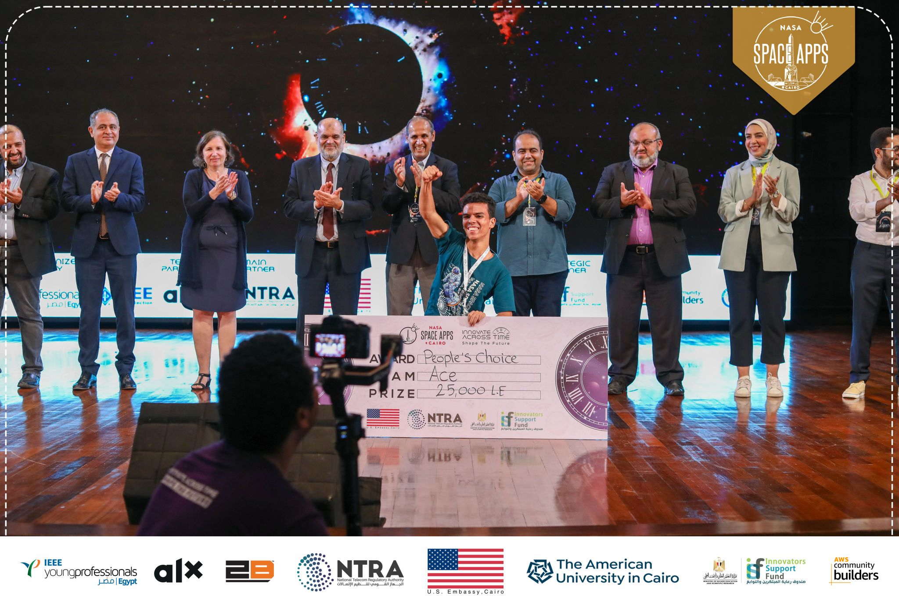
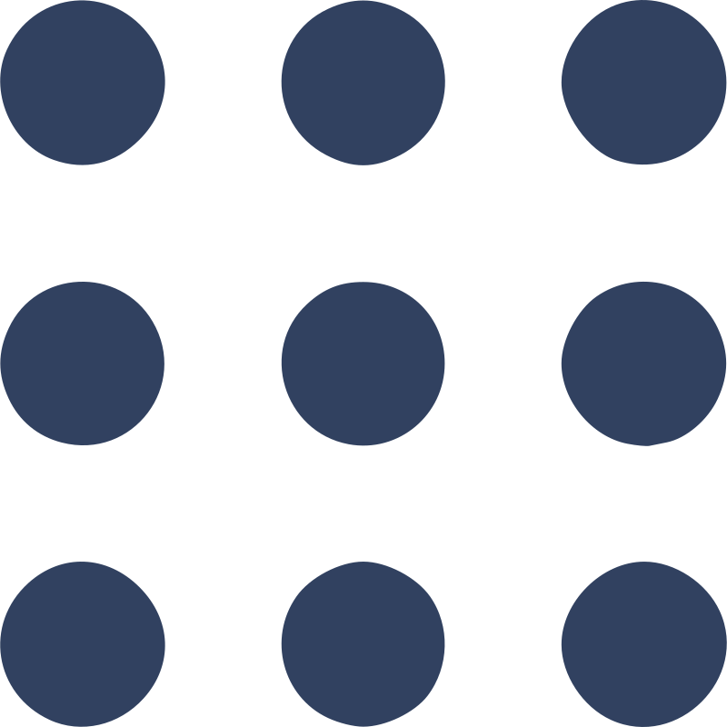

# Hello, I'm Morad Sayed! 👋

🔧 Aspiring Automotive Mechatronics Engineer | Undergraduate at Helwan University 🎓

Hey there! I'm **Morad Sayed**, an automotive mechatronics engineer currently pursuing my undergraduate degree at Helwan University. I have a strong passion for exploring new horizons in vehicle design and optimization, and I am enthusiastic about making a meaningful impact on the future of mobility.

## Featured Project: Cosmic Sonifier 🚀

A solo participant in the NASA Space Apps challenge, I crafted the **Cosmic Sonifier** to convert 3D space data into immersive soundscapes, earning the People's Choice Award. My project, designed for inclusivity and education, makes space exploration accessible to all, particularly those with visual impairments. It marks a significant step towards democratizing space exploration and fostering a deeper connection with the cosmos.

*Obtaining the People’s Choice Award for NASA Space Apps Cairo 2023*

## 🛠️ Languages and Tools 🧰

&nbsp;&nbsp;&nbsp;&nbsp;
&nbsp;&nbsp;&nbsp;&nbsp;
&nbsp;&nbsp;&nbsp;&nbsp;
&nbsp;&nbsp;&nbsp;&nbsp;
&nbsp;&nbsp;&nbsp;&nbsp;

## Connect with Me

Let's connect and collaborate! You can find me on .

